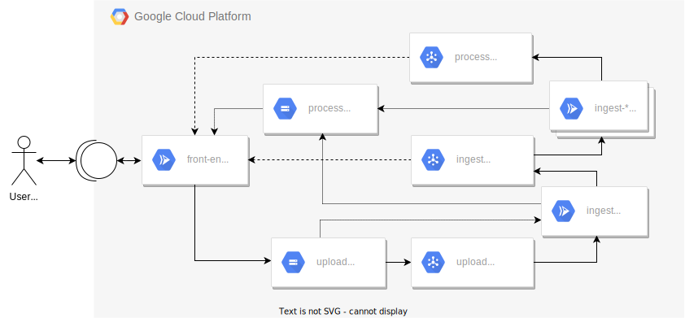

# serverless-storage-demo
[](https://github.com/andrejusk/serverless-storage-demo/actions/workflows/push.yml)


Deploy a simple serverless workload
on [Cloud Run](https://cloud.google.com/run/docs)
using [Terraform](https://www.terraform.io/docs).

This demo repository is based on the
["Build a Serverless App with Cloud Run that Creates PDF Files"](https://www.qwiklabs.com/focuses/8390?parent=catalog)
[Qwiklabs](https://www.qwiklabs.com/) quest.

# Architecture

Our infrastructure is backed by the following Google Cloud services:

- [Compute Engine](https://cloud.google.com/compute/docs)
    - Cloud Run
- [Cloud Storage](https://cloud.google.com/storage/docs)
    - [Storage Notifications](https://cloud.google.com/storage/docs/pubsub-notifications)
- [Cloud Pub/Sub](https://cloud.google.com/pubsub/docs) 



The `front-end` service exposes a public HTTP interface
to the user. New files are ingested into the `upload`
Cloud Bucket, which notifies the `ingest` service through
the `upload` Pub/Sub topic.

Successful uploads are saved to the `processed` Cloud Bucket,
and can kick off additional workloads through the `ingest` topic.
Further processing notifies consumers using the `processed` topic.

# Source

## Packages

Re-usable components, maintained in `/` (root) and `/packages`.

| Package name                                              | Description                                                        |
| --------------------------------------------------------- | ------------------------------------------------------------------ |
| [serverless-storage-demo](package.json)                                | Root-level workspace containing development dependencies & scripts |
| [ingest](packages/ingest/package.json) | Cloud Storage file ingest service                    |
| [ingest-pdf](packages/ingest-pdf/package.json)     | Document to PDF converter                    |
| [front-end](packages/front-end/package.json)   | User facing web service |

## Setup

Ensure tools are installed if required:

| Language | Version | Tools                                                                                                                                                    |
| -------- | ------- | -------------------------------------------------------------------------------------------------------------------------------------------------------- |
| Node.JS  | v14     | nvm: https://github.com/nvm-sh/nvm<br>Version is locked in [.nvmrc](/.

Ensure version of Node.JS is correct:

    # If using external version manager
    nvm current
    nvm install && nvm use

    node --version

Install dependencies:

    # If pnpm not installed
    npm i -g pnpm@6.32.4

    pnpm install

## Checks

TBD

## Usage

TBD

## Terraform Module

```hcl
# TBD
```

